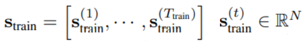

# Anomaly detection
## 1. Deep SVDD
Ruff, L., Vandermeulen, R., Goernitz, N., Deecke, L., Siddiqui, S. A., Binder, A., ... & Kloft, M. (2018, July). Deep one-class classification. In International conference on machine learning (pp. 4393-4402). PMLR.
### 개요
- 정상 데이터를 중심이 c인 Hypersphere에 가까워지도록 데이터를 Mapping &#8594; 비정상 데이터는 Hypersphere 외부에 Mapping됨  
  
  

### The Deep SVDD Objective  
#### 1. Soft-boundary Deep SVDD objective
- 딥러닝 모델 φ(DCAE의 encoder 사용)에 의해 Mapping된 데이터가 중심 c와 가깝고(두 번째 term) 반지름 R이 최소화 되도록(첫 번째 term) 반지름 R과 딥러닝 모델의 Weight를 학습
- Hyperparameter ν ∈ (0, 1]를 통해 Boundary에 여유를 조절할 수 있음
- 학습 시 W와 R을 번갈아가면서 최적화 진행(한 변수 고정시키고 다른 변수 학습하고, ... 반복)
  
 
#### 2. One-Class Deep SVDD objective
- Soft-boundary Deep SVDD objective의 심플한 버전
- 반지름 R에 대한 것을 없애고 Mapping된 데이터가 최대한 c와 가까워지도록 학습
  
 

### Anomaly score
- One-Class Deep SVDD objective로 학습 시켰을 경우 Test 데이터를 식 (5)에 넣어서 양수가 나오면 비정상, 음수가 나오면 정상으로 판단
- Soft-boundary Deep SVDD objective로 학습 시켰을 경우 식 (5)에서 R∗을 뺀 값을 기준으로 양수가 나오면 비정상, 음수가 나오면 정상으로 판단  
  
  

## 2. MAD-GAN(Time series)
Li, D., Chen, D., Jin, B., Shi, L., Goh, J., & Ng, S. K. (2019, September). MAD-GAN: Multivariate anomaly detection for time series data with generative adversarial networks. In International Conference on Artificial Neural Networks (pp. 703-716). Springer, Cham.  
### 개요
- LSTM-RNN을 기본 모델(generator, discriminator)로 사용하여 GAN 기반의 비지도 다변수 이상치 탐지 방법 제안 
- 전체 변수를 동시에 고려하여 변수 간의 잠재적 상호 작용 파악 
- DR-score라는 anomaly score를 사용하여 GAN에서 생성된 generator와 discriminator를 활용하여 reconstruction loss와 discrimination loss를 통해 이상치 탐지 
- SWaT, WADI 데이터 사용  
### Anomaly Detection with Generative Adversarial Training
#### 1. MAD-GAN Architecture
  
  
- 왼쪽은 일반적인 GAN
- 오른쪽은 Anomaly detection
  - Reconstruction loss: 실제 데이터를 latent space로 mapping → mapping 된 데이터를 Generator에 넣어서 데이터 생성 → 생성된 것과 실제 데이터를 latent space로 mapping한 후 reconstruction error 구함
  - Discrimination loss: discriminator가 fake라고 할수록 anomaly일 가능성 높다는 것을 사용한 듯(확인 필요)

## 3. DAGMM(Time series)
Zong, B., Song, Q., Min, M. R., Cheng, W., Lumezanu, C., Cho, D., & Chen, H. (2018, February). Deep autoencoding gaussian mixture model for unsupervised anomaly detection. In International conference on learning representations.  
### 개요
- DAGMM은 deep autoencoder를 활용하여 각 입력 데이터 포인트에 대한 저차원 표현 및 reconstruction error를 생성하며, 이는 GMM(가우시안 혼합 모델)에 제공됨  
- DAGMM은 분리된(decoupled) two-stage training과 standard EM(Expectation-Maximization) 알고리즘을 사용하는 대신, mixture model의 매개변수 학습을 용이하게 하기 위해 별도의 Estimation network를 활용하여 deep autoencoder와 mixture model의 매개변수를 end-to-end 방식으로 동시에 최적화  
### Introduction
#### 장점 1
- (Compression network에서)DAGMM은 아래 그림처럼 두 가지 정보(reduced dimension, reconstruction error)를 사용하기 때문에 중요 정보가 보존됨
  
  
#### 장점 2
- Compression network에서 나온 low-dimensional space에 대해 GMM(Gaussian Mixture Model) 적용
- end-to-end로 학습시키려고 Estimation network를 만들고 그 결과를 이용해서 energy를 구함
- Compression network의 reconstruction error와 Estimation network의 energy가 최소가 되도록 모델 학습 → 차원 축소와 밀도 추정이 동시에 학습됨  
#### 장점 3
- 이전의 Autoencoder는 end-to-end 학습이 어려워서 pre-training 과정이 필요했는데 본 연구에서는 Estimation network에 대해 regularization을 추가하여 Compression network가 local optima에서 탈출하는데 크게 도움이 되기 때문에 end-to-end 학습이 잘 됨
### DEEP AUTOENCODING GAUSSIAN MIXTURE MODE
#### 1. Overview  
  
  
#### 2. Compression network
- z_c는 일반적인 autoencoder의 latent vector이고 z_r은 z_c로부터 생성된 x’와 x의 reconstruction error(본 논문에서는 Euclidean distance, cosine similarity 등을 사용할 수 있다고 나와있음)  
#### 3. Estimation network  
  
  
- (GMM 설명 블로그 참고: https://untitledtblog.tistory.com/133)
- 학습된 GMM 매개변수를 사용하여 테스트 단계에서 sample 에너지를 추정하고 사전 선택된 threshold로 high energy 샘플을 이상치로 예측
- Compression network의 output인 z를 받아서 MLN(Multi-Layer Neural network) 지남 → 감마햇 = softmax(p) (batch size는 N이고 총 K개(사람이 설정해줌)의 그룹에 대한 분류) → 감마햇으로 N개의 샘플(batch)에 대해서 component k에 대한 확률, 평균, covariance를 구함
- (6)번 식은 (아마도) 마이너스 log likelihood인데 이를 최소화 시키면 likelihood가 최대화 되니깐 정상 데이터에 대한 밀도 추정이 잘 됨
#### 4. Objective function  
  
  
- L(xi, xi’): reconstruction error(Compression network)
- E(zi): 학습은 정상 데이터에 대해서만 이루어지므로 E(z)가 작아지도록 학습→ anomaly에 대해서는 E(z)가 커짐
- P: Sigularity problem(trivial solution) 해결하려고 추가함

## 4. GDN(Time series)
Deng, A., & Hooi, B. (2021, February). Graph neural network-based anomaly detection in multivariate time series. In Proceedings of the AAAI Conference on Artificial Intelligence (Vol. 35, No. 5, pp. 4027-4035).  
### 개요
- structure learning approach 방식과 graph neural network를 결합하고 추가로 attention weight를 사용하여 감지된 이상치에 대한 설명 가능성을 제공
- 변수 간의 관계 구조를 Graph 형태로 학습하여 시계열 예측에 사용
### Proposed Framework
#### 1. Problem Statement
  
 
- N개의 센서, 전체 길이(시간)는 T_train
- t 시점에서 s^(t)는 N차원
- train 데이터는 모두 정상으로 이루어짐
- test 데이터(s_test)는 정상/비정상을 a(t) =0/1로 label됨
#### 2. Overview
  
 
#### 3. Sensor embedding
  
 
- N개의 센서 각각에 대해 d차원으로 embedding
- (1) Structure learning에 사용됨(어떤 센서가 서로 연관되어 있는지)
- (2) Attention mechanism에 사용됨
#### 4. Graph structure learning
- 센서 간의 관계를 graph structure로 표현
- node는 센서, edge는 dependency relationships를 나타냄
- 한 센서에서 다른 센서로의 edge는 첫 번째 센서가 두 번째 센서의 동작을 모델링하는 데 사용됨을 나타냄
- Directed graph(방향이 있는 그래프) 형태(dependency 를 표현하기 위해)
- adjacency matrix A (Aij가 있다는 것은node i에서 node j edge가 있다는 것)
- vi, vj를 가지고 센서 간의 similarity eji 구함 → 만약 Top k(사람이 설정) 안에 j가 들어 있다면 Aji = 1(연관성이 상위 k개 안에 들면 1) 
#### 5. Graph attention-based forecasting
- input 데이터는 N개의 센서에 대해 w개의 시점 씩 sliding
  
 
- (Feature extractor) 결과적으로 xi를 zi로 만들어줌. 이때 Sensor embedding vi와 데이터 xi를 이용해서 attention a(알파)를 구해서 사용하며 N(i) = {j | Aji > 0}이기 때문에 i와 관련된 j에 대해서만 zi를 구함
  
 
- (Output layer) f_세타 함수는 일반적인 FC 모델로 (t-w)에서 (t-1) 시점의 데이터 x^(t)로부터 만들어진 z^(t)를 입력으로 받아서 그 다음 시점인 (t) 시점의 값을 예측. Loss는 MSE 사용
  
 
#### 6. Graph deviation scoring
  
 
