# Detection & Segmentation
## 1. Cascade R-CNN
Cai, Z., & Vasconcelos, N. (2019). Cascade R-CNN: high quality object detection and instance segmentation. IEEE transactions on pattern analysis and machine intelligence.  
### 개요
- Multi-stage extension of the R-CNN  
  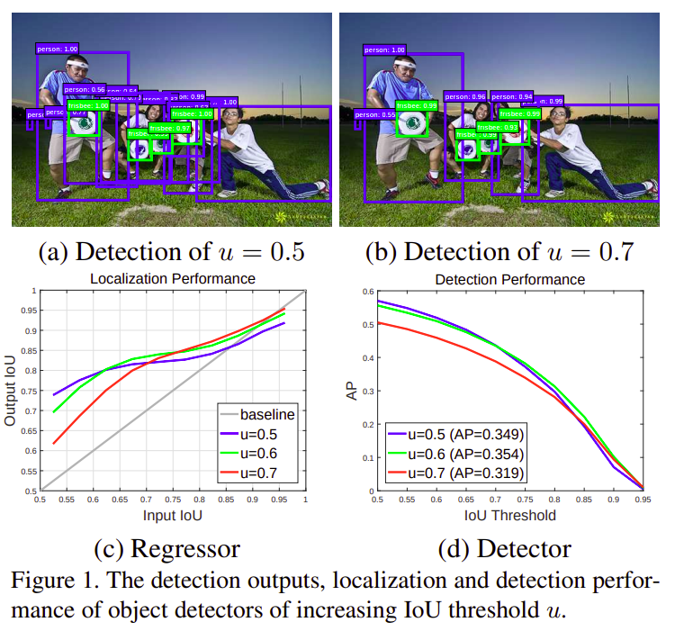
  
- 일반적으로 threshold IoU를 낮게 설정하면 Detector의 BBox 예측이 부정확하고(Figure 1. (a)) 높게 설정하면 BBox의 예측은 정확해지지만 Recall이 감소(객체를 적게 검출)해서 AP 감소  
- Regressor의 Output IoU가 Input IoU보다 낫기 때문에(Figure 1. (C)) Cascade R-CNN의 각 stage는 __이전 stage의 output을 사용하여 순차적으로 학습(_boostrapping과 유사함_)__  
- 이후의 stage는 이전보다 threshold IoU를 증가시킴 &#8594; stage가 진행될수록 좀 더 정확한 proposal로 학습하게 됨  

### Architecture  
  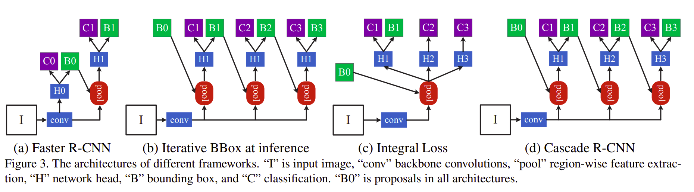
  
- Figure 3. (d)에 해당하는 그림이 Cascade R-CNN의 구조
- (b)는 head가 H1으로 동일(공유)하지만 (d)는 H1, H2, H3로 세 개의 head가 학습됨  
- Figure 1. (c)에서 확인한 것처럼 Input IoU보다 Output IoU가 높기 때문에 B1보다는 B2의 IoU가 더 높기 때문에 학습이 순차적으로 진행될수록(B1 &#8594; B2 &#8594; B3) 성능 향상  

## 2. Mask R-CNN
He, K., Gkioxari, G., Dollár, P., & Girshick, R. (2017). Mask r-cnn. In Proceedings of the IEEE international conference on computer vision (pp. 2961-2969).  

## 3. YOLO
- __One-stage detector__: YOLO는 객체의 위치와 클래스를 한 단계로 파악하기 때문에 굉장히 빠르고 단순한 구조  
### 3.1. YOLO v1
Redmon, J., Divvala, S., Girshick, R., & Farhadi, A. (2016). You only look once: Unified, real-time object detection. In Proceedings of the IEEE conference on computer vision and pattern recognition (pp. 779-788).  

### 개요  
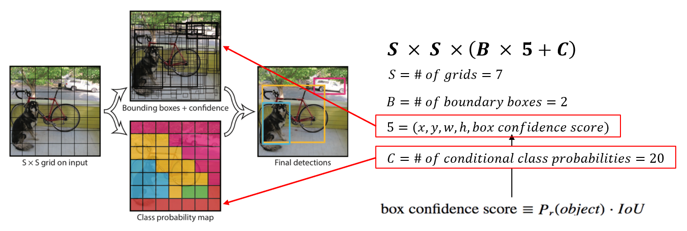
  
- 이미지를 S by S의 grid cell로 나눈 후, 셀마다 B개의 bounding box와 class probability를 예측  
- 하나의 neural network에 의해 진행(One-stage detector)  
- S는 가로, 세로 몇 칸으로 나누는지를 나타내며 7로 설정  
- B는 각 셀마다 몇 개의 bounding box를 예측할지를 나타내며 2로 설정  
- 5는 박스에 대한 정보 5가지를 말하는데, x와 y는 bounding box의 좌표를 말하며, w와 h는 가로, 세로 길이, box confidence score는 물체의 존재정도  
- C는 각 셀별 class probability를 나타내며 총 20개의 클래스가 존재하기 때문에 C는 20  

### Architecture  
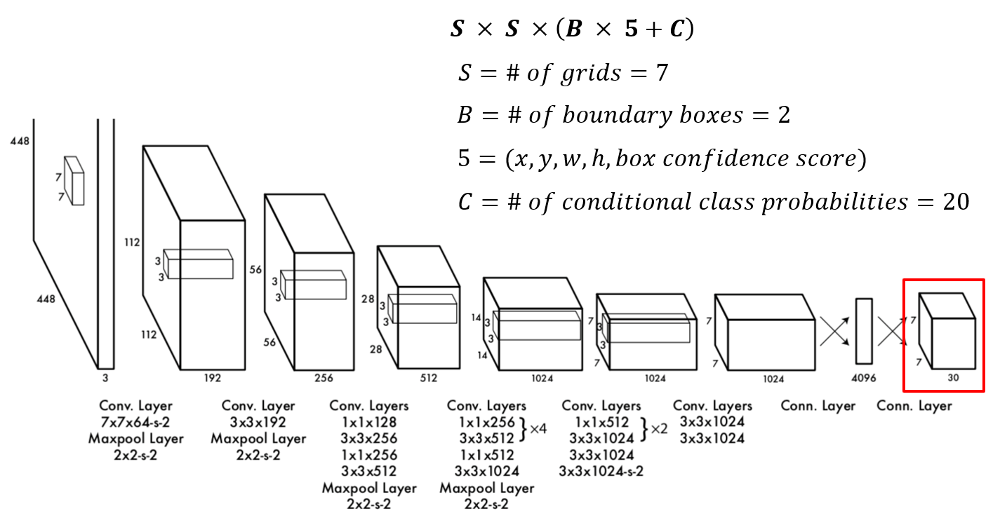
  
- YOLO는 총 24개의 convolution layer와 2개의 fully connected layer로 구성되어 있으며 convolutional layer 중간 중간에 1 by 1 layer를 두어서 feature 줄임  
- 최종 output이 7x7x30임을 알 수 있는데, 이는 이미지를 7x7의 셀로 나누고, 각각의 셀마다 5가지의 박스 정보를 가지는 박스 2개와, 20개 Class probability를 가지고 있기 때문임

### Training
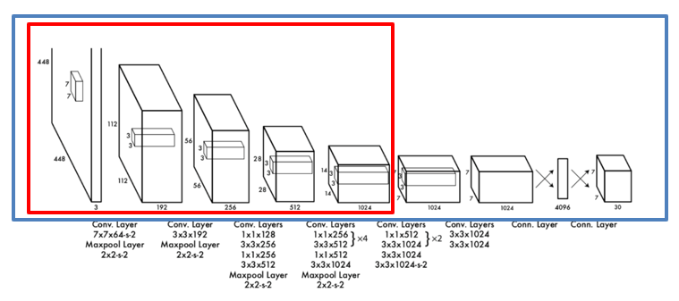
  
- __Pretrain (Classification)__: 전체 24개의 convolutional layer 중 처음 20개의 layer를 ImageNet dataset으로 filter들을 pretrain함
- __Convert (Detection)__
  - Pretrain된 모델에 4개의 convolution layer와 2개의 fully connected layer를 추가하여 detection 모델을 구축한 뒤 학습을 진행  
  - 데이터는 Pascal voc 2007과 2012를 사용했으며 총 135 epoch동안 학습, Overfitting을 피하기 위해 Dropout과 Data augmentation을 사용  

#### Total loss  
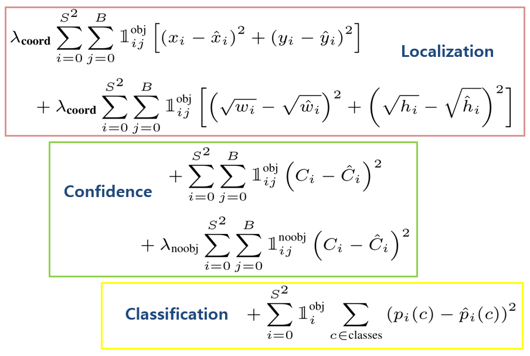
  

#### (1) Localization loss
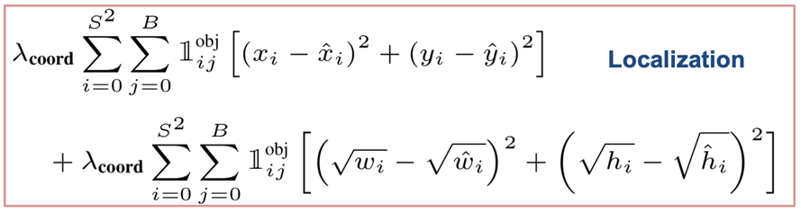
  
- BBox의 위치에 대한 Loss
- x, y는 BBox의 좌표, w, h는 가로, 세로 길이(W와 h에 Root를 취한 것은 큰 Box의 작은 편차가 작은 Box의 편차보다 덜 중요하다기 때문)
- 1obj로 box가 존재한다고 예측할 때만 이 Loss를 더해줌
- 람다를 통해 Localization loss의 가중치를 조절

#### (2) Confidence loss  
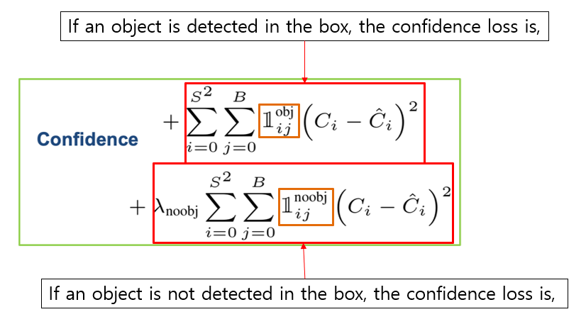
  
- 물체의 존재유무 평가  
- Confidence loss는 두 부분으로 나눌 수 있는데, 첫번째는 물체가 있다고 예측될 때, 두번째는 물체가 없다고 예측될 때
- Ci hat의 경우 YOLO가 예측한 Box confidence score, Ci는 실제 값. 따라서 Ci는 실제로 해당 Cell에 물체가 존재하면 1, 존재하지 않으면 0
- 람다noobj는 물체가 없을 때의 효과를 줄여주기 위해 0.5를 곱함(물체가 없는 경우가 상대적으로 더 많기 때문에, 없을 때의 Loss가 많음)

#### (3) Classification loss  
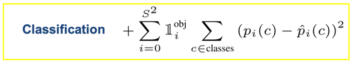
  
- 각 Cell마다 20개의 Class에 대한 Loss 값을 계산  
- BBox의 개수와 상관없이 각 Cell 별로 한번씩 계산  

### Non-maximal suppression (NMS)  
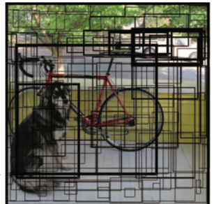
  
- YOLO는 Cell마다 두 개의 BBox 예측하기 때문에 7 by 7일 때 98개의 BBox가 생김 &#8594; 겹치는 BBox 많음   
- NMS는 겹치는 BBox를 제거하는 기법  
- __제거 과정__  
  (1) 가장 큰 Box confidence score를 가지는 Box를 선택  
  (2) (1)에서 선택된 Box와 다른 Box 간의 IoU를 계산 &#8594; 특정 threshold(예를 들어 0.5)보다 클 경우 Box 지움   
  (3) 특정 Box의 갯수가 남거나, 선택할 Box가 없을 때까지 (1), (2) 반복  
  
### Limitation 
성능이 안 좋은 상황  
- Cell 별로 2개의 BBox만을  예측 &#8594; 여러 물체가 겹쳐있을 때 객체 검출이 어려움  
- 하나의 Cell이 전체 이미지에 비해 큼 &#8594; 작은 물체는 잘 검출하지 못함  
- 훈련 데이터와 BBox 비율이 다른 객체 검출은 어려움
- Downsampling을 하기 때문에 고화질의 feature는 잡아내기 어려움  

### Experiments 
- 요약하자면 빠르고 좋다  

### 3.2. YOLO v2
Redmon, J., & Farhadi, A. (2017). YOLO9000: better, faster, stronger. In Proceedings of the IEEE conference on computer vision and pattern recognition (pp. 7263-7271).  

- __YOLO v1의 문제점__ 은 (1) Localization error가 크다는 점, (2) 상대적으로 low recall, 즉 전체 물체 중 찾아내지 못한 것이 있다는 점(각각의 Grid cell이 하나의 Class만 예측 &#8594; 작은 Object 여러 개가 다닥다닥 붙으면 제대로 예측하지 못함)
- __YOLO v2__ 에서는 속도와 Classification, Detector 정확도는 유지하면서 __Recall과 Localization을 향상__ 을 목표로 함
  

### High Resolution Classifier  
- YOLO v1  
  1) 처음부터 끝 Layer까지 224x224의 이미지에 대해서 학습시키고나서 448x448 이미지에 대한 Detection을 진행했기 때문에 classifier가 고해상도에 대해서는 학습을 못함
- YOLO v2  
  1) Darknet-19을 classfication network로 사용하여 __ImageNet 데이터(고해상도)__ 를 10 epoch 동안 학습 
  2) Darknet-19의 마지막 Convolutional layer와 Avgpool, Softmax를 제거하고 Object detection layer 4개 추가  

### Convolutional With Anchor Boxes  
- YOLO v1는 Cell 별로 임의의 크기를 가지는 BBox 2개 씩 예측 &#8594; 실제 상황에서는 BBox가 임의의 크기를 가지지 않고 특정 크기로 존재  
- YOLO v2는 임의의 박스를 그리는 것이 아닌 정해진 크기의 박스(Anchor box)에 대해서 Offset을 예측  
- Cell마다 5개의 Anchor box를 예측하므로 최종 Output이 SxSx(5x(5+20))이 됨(5+20은 Anchor box의 5가지 정보 + 20개의 Class probability)    

### Fine Grained Features  
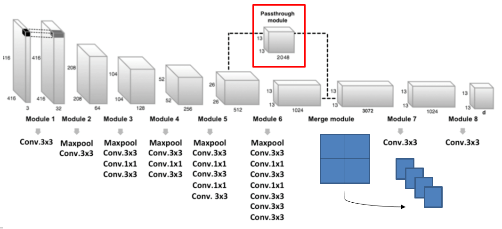
  
- 작은 Object를 잡아내기 위해서 추가함  
- 13x13는 큰 Object는 잡아낼 수 있지만 작은 Object는 잡아내기 힘듦 &#8594; 중간의 26x26를 13x13으로 변환한 후 13x13과 결합(__Passthrough layer__)  

### Darknet-19  

  
- Backbone으로 19개의 Convolutional layer와 5개의  Maxpooling layer를 사용한 Darknet-19 사용
- Darknet-19는 Classification을 위해 사용되며 이후에 마지막 layer 부분이 제거되고 Detection 부분 추가됨  
- VGG-16처럼 작은 Filter를 깊게 쌓아 구성, 3x3 Convolutional layer 사이에 1x1 filter를 배치해서 feature 압축  

### Architecture  
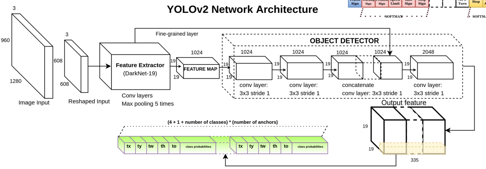
  
- 앞쪽의 Darknet-19가 Classification 이며 뒷쪽이 Detection 부분  

### 3.3. YOLO v3
Redmon, J., & Farhadi, A. (2018). Yolov3: An incremental improvement. arXiv preprint arXiv:1804.02767.  
- YOLO v3는 v2와 비교해서 Backbone과 FPN이 추가된 점이 다름  

### Darknet-53
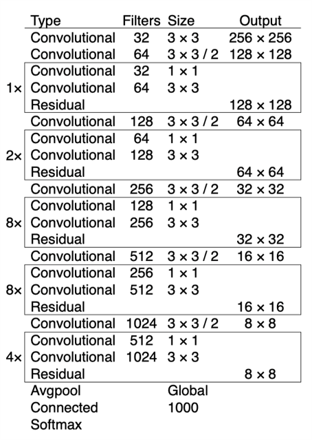
 
- YOLO v3는 Backbone으로 Darknet-53을 사용
- YOLO v2의 Darknet-19에 ResNet에서 제안된 Skip connection 개념 적용하여 레이어를 많이 쌓음

### Prediction across scales
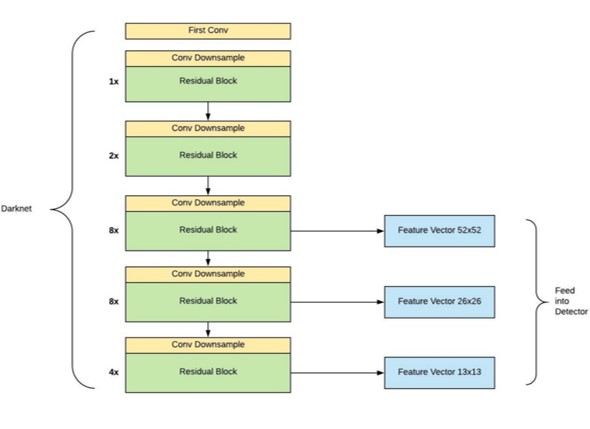
 
- Feature Pyramid Network (FPN)과 비슷한 방법으로 3개의 스케일에서 Feature를 추출 &#8594; 해상도가 다른 세가지 스케일의 정보 사용해서 Detection 진행  
- Low level의 Feature로 이미지의 세세한 객체 정보를 잃지 않음  
- High level의 Feature로는 큰 객체에 대한 정보 사용할 수 있게 됨  

### 3.4. YOLO v4
Bochkovskiy, A., Wang, C. Y., & Liao, H. Y. M. (2020). Yolov4: Optimal speed and accuracy of object detection. arXiv preprint arXiv:2004.10934.  
