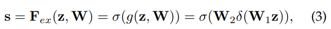
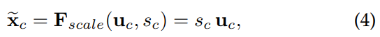
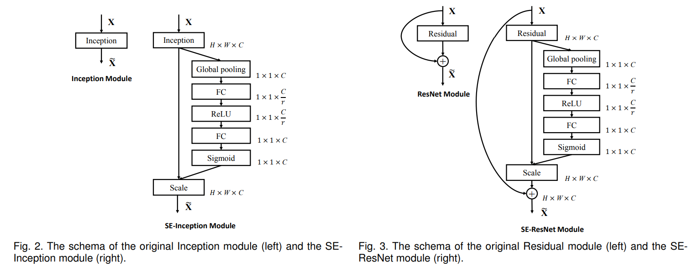

# Image classification
## 1. Squeeze-and-Excitation Networks (SENet)
Hu, J., Shen, L., & Sun, G. (2018). Squeeze-and-excitation networks. In Proceedings of the IEEE conference on computer vision and pattern recognition (pp. 7132-7141).

### 요약
- Squeeze-and-Excitation Networks (SENet)은 간단한 구조 변경으로 기존 모델보다 성능을 크게 향상시킨 기법으로 Imagenet 데이터에 적용하여 top-5 error 2.25% 달성  
- 다른 모델에 SE block을 쉽게 적용할 수 있으며 연산량도 크게 늘어나지 않는다는 장점 있음  

### 모델 설명  
상당히 간단하므로 그림으로 설명  

  
- Ftr은 Convolutional layer라고 생각하면 됨 &#8594; Ftr 연산의 결과 Channel이 C인 Feature map U가 생김
- Fsq는 Channel 별로 Global average pooling하는 연산 &#8594; Fsq 연산의 결과 Channel 별로 하나의 실수가 나오므로 결과적으로 길이가 C인 벡터가 나옴  
- Fex는 [FC &#8594; ReLU &#8594; FC &#8594; Sigmoid 연산] &#8594; 연산의 결과 Channel 별로 0 ~ 1 값을 갖는 길이가 C인 벡터(s)가 됨  
  
  
- 위의 결과를 U에 대해 Channel 별로 Weighted sum하면 최종 output이 됨  
  
  

### 다른 모델에 적용한 결과

  
