# Image Generation
## 1. SRGAN
Ledig, C., Theis, L., Huszár, F., Caballero, J., Cunningham, A., Acosta, A., ... & Wang, Z. (2016). Photo-realistic single image super-resolution using a generative adversarial network. arXiv preprint 2016.

### 요약
- Super Resolution(SR, 화질 개선 및 이미지 사이즈 증가) 알고리즘
- 기존 SR 알고리즘은 loss를 (pixel-wise)MSE과 PSNR로 구성 &#8594; 생성된 이미지의 질감(texture) 표현에 한계(smooth하게만 표현)
- loss를 개선하여 기존 알고리즘의 한계 극복 &#8594; Perceptual loss function(Content loss + Adversarial loss)

### Method
#### (1) Architecture
- GAN  
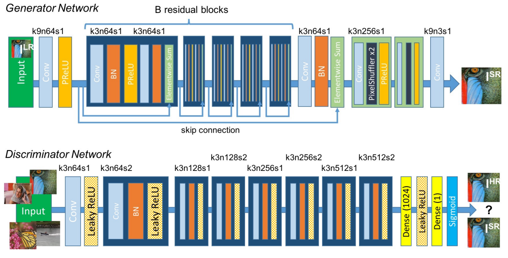

#### (2) Loss function
- Perceptual loss function  
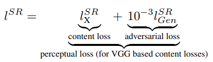

- Content loss  

  이미지 자체(pixel)를 비교하던 기존 loss를 feature map을 비교하는 loss로 변경  
  
  __기존의 pixel-wise MSE loss__  
  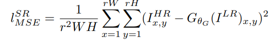

  __수정된 loss(Content loss)__  
  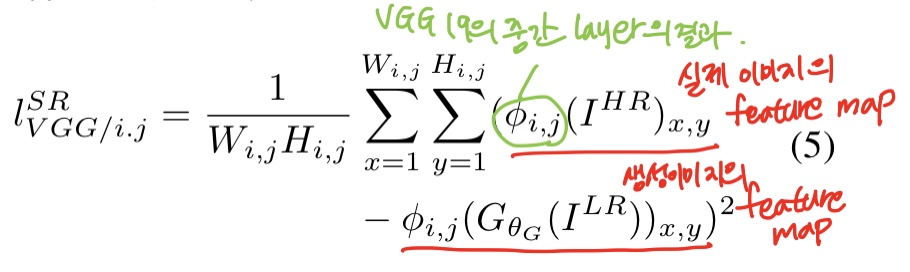

- Advrsarial loss  
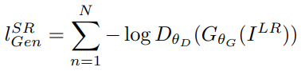
  

## 2. ESRGAN
Wang, X., Yu, K., Wu, S., Gu, J., Liu, Y., Dong, C., ... & Change Loy, C. (2018). Esrgan: Enhanced super-resolution generative adversarial networks. In Proceedings of the European Conference on Computer Vision (ECCV) Workshops (pp. 0-0).

### 요약
- SRGAN에서 3가지 부분(Architecture, Discriminator, Perceptual loss) 개선  

### Method  
#### (1) Architecture(Generator)  
- Batch Normalization(BN) 제거 & Residual scaling 도입  
  BN은 훈련 중에 batch의 평균과 분산을 사용하여 feature를 normalize하고 테스트 중에 전체 학습 데이터의 추정된 평균과 분산을 사용. 훈련 및 테스트 데이터의 통계값이 많이 다를 때 BN 계층은 unpleasant artifact를 도입하고 일반화 능력 제한 &#8594; BN 레이어를 제거하여 일반화 능력을 향상시키고 계산 복잡성과 메모리 사용량을 줄임   
  residual을 0과 1사이의 상수를 곱하여 scaling down하는 Residual scaling를 도입하여 안정적으로 만듦
- Residual-in-Residual Dense Block(RDDB) 도입 &#8594; higher capacity & easier to train  
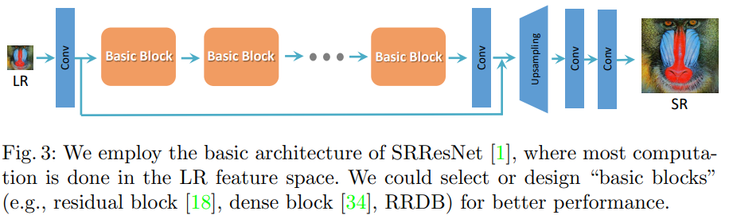
  
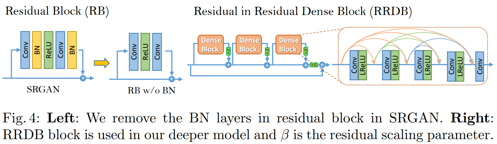
  

#### (2) Discriminator  
- Relativistic GAN(RaGAN) 사용: 기존 GAN의 Discriminator는 real인지 fake인지 판단하는 이진 분류였다면 RaGAN의 Discriminator는 한 이미지가 다른 이미지보다 더 실제 같은지를 판단 &#8594; more realistic texture details  
  __Standard Discriminator & Relativistic Discriminator__  
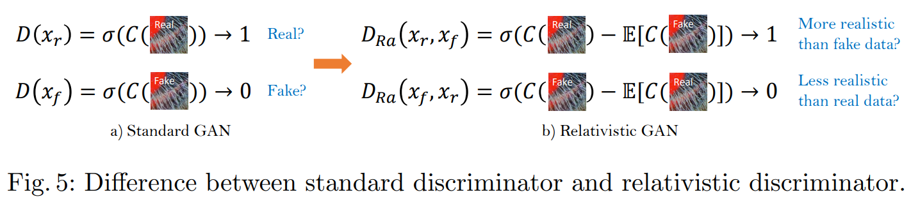
  
  __Discriminator loss__  
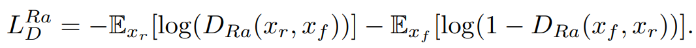
  
  __Generator loss__  
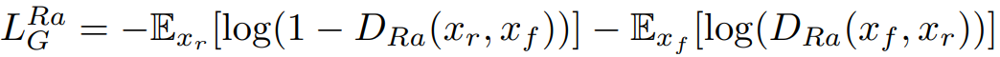
  
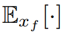
는 실제 데이터(Xr) 한 개에 대해 생성된 이미지(Xf)는 여러 개이므로, 모든 mini-batch의 fake data에 대해 average 취함  
  SRGAN에서는 Generator loss가 생성된 이미지에 대해서만 영향을 받지만 ESRGAN에서는 실제 데이터와 생성된 데이터 모두로부터 영향 받음  
#### (3) Perceptual loss 개선  
- activation 이전의 VGG feature 사용(SRGAN에서는 activation 이후의 feature 사용) &#8594; sharper edges & more visually pleasing results  
- activation을 취한 feature는 Sparse해진다는 문제 존재(특히 Very deep network일 경우 더욱 심함) &#8594; weak supervision & inferior performance(아래 그림에서 after activation을 보면 feature가 많이 사라짐을 알 수 있음)    
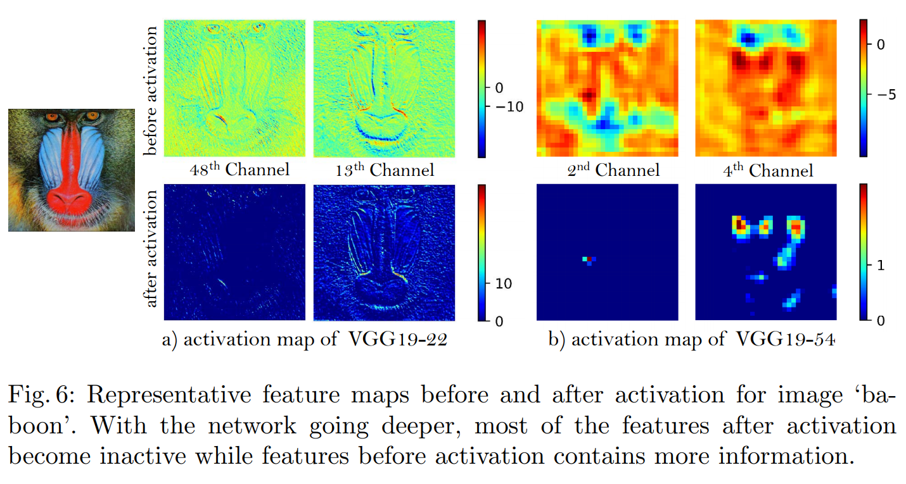
  
  __Total loss for the Generator__  
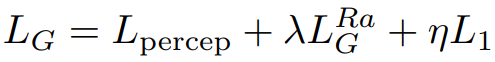
  
  __L1 loss__  
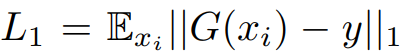
  
  LG는 전체 Generator의 loss이며 Lpercep와 LGRa로 이루어짐
