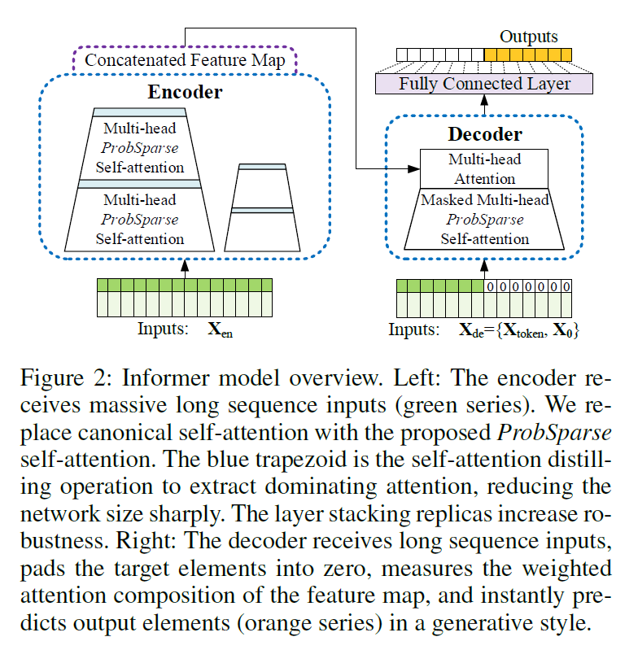
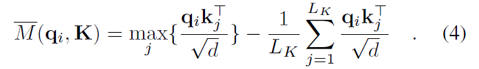
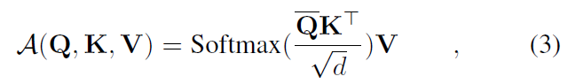
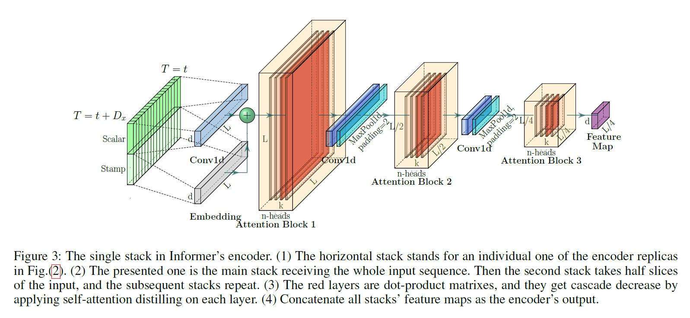
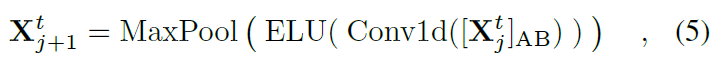
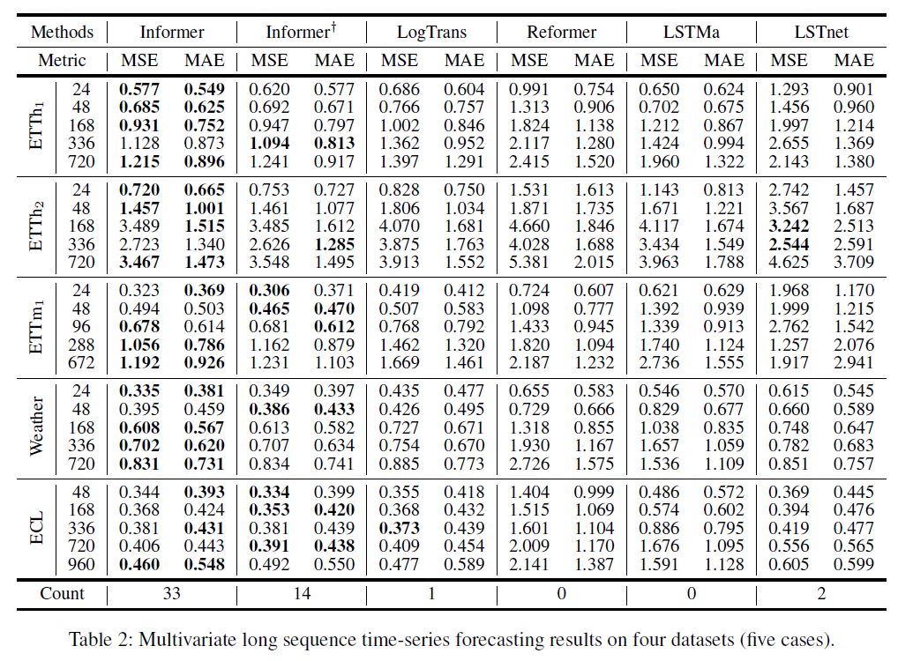
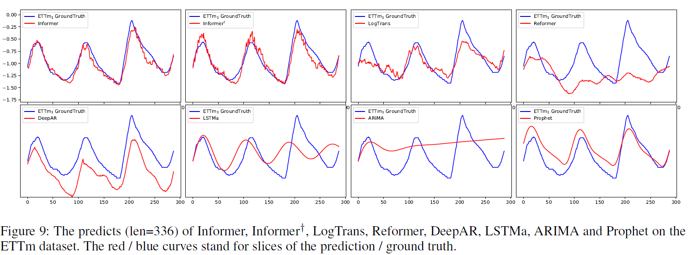
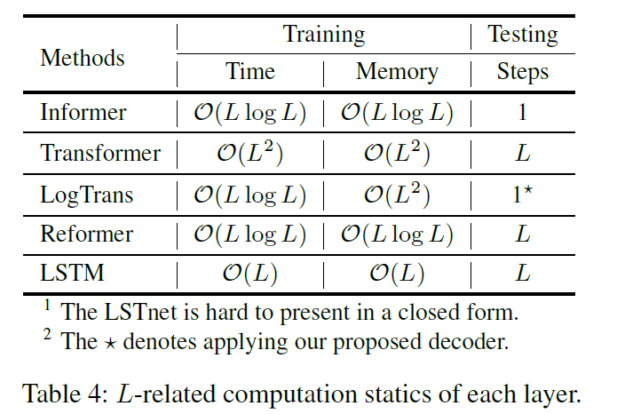

# Time series

## 1. Informer
Zhou, H., Zhang, S., Peng, J., Zhang, S., Li, J., Xiong, H., & Zhang, W. (2021, May). Informer: Beyond efficient transformer for long sequence time-series forecasting. In Proceedings of AAAI.

### 개요

  

- Transformer를 개선하여 Long sequence time-series forecasting (LSTF)에 적합하도록 수정한 모델  
- 기존의 딥러닝 모델(예를 들어 LSTM)을 이용한 시계열 예측의 경우 Sequence가 길어질수록 정확도와 Inference speed가 떨어진다는 문제 존재  
- Transformer도 LSTF에 대해 세 가지 측면에서 한계점 존재  
  - The Quadratic computation of self-attention  
    - 1개의 layer에 대해 Self-attention의 계산량은 __O(L2)__   
    - __ProbSparse self-attention__ 으로 문제 해결  
  - The memory bottleneck in stacking layers for long inputs  
    - J개의 layer에 대해 계산량은 __O(J*L2)__   
    - __Self-attention distilling operation__ 으로 문제 해결  
  - The speed plunge in predicting long outputs  
    - Inference 시 Decoder에서 Dynamic decoding 방식으로 예측(k번째 예측을 다시 input으로 넣어서 k+1번째 예측)하던 것을 수정하여 one forward step으로 바꿔서 문제 해결  

### Methodology

#### Efficient Self-attention Mechanism

##### ProbSparse Self-attention
- 기존 Transformer가 Self-attention 시 O(L2) 계산해야 하는 것을 줄이기 위해서 Query 중 일부를 샘플링한 후 M으로 중요한 Query만 뽑아 Self-attention을 구하는 방법  
- Query 중 U = LKlnLQ개 샘플링  
- 샘플링 된 Query에 대해 M bar 구함  

  
- M을 기준으로 u = clnLQ개만큼의 Query(Q bar) 사용하여 Self-attention 구함  

  

#### Encoder: Allowing for Processing Longer Sequential Inputs under the Memory Usage Limitation

##### Self-attention Distilling

  
- Self-attention layer 사이에 Max Pooling 추가하여 차원 축소 시킴
  

   

#### Decoder: Generating Long Sequential Outputs Through One Forward Procedure

- Inference 시 dynamic decoding 방법을 사용하지 않음
- Figure 2에서 Decoder의 Inputs을 보면 알 수 있듯이 Encoder의 Input과 일부 겹치게 Xtoken을 구성하고 Output에 해당하는 부분은 0으로 채워서 X0 구성함
- Inputs으로 바로 X0에 해당하는 부분의 값 예측

### 실험 결과

  

  

### 계산량 비교

  
